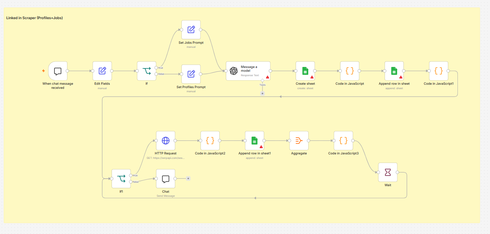

<div align="center">

# 🚀 AI Workflows for n8n

### Production-ready AI Automation Workflows built with **n8n**

A curated collection of AI-powered workflows demonstrating **LLMs, RAG, Human-in-the-Loop systems, Telegram bots, Discord integrations, Gmail automation, LinkedIn scraping, Cloudflare Workers, and more.**

<p>


</p>

</div>

---

# 📖 About

This repository contains a collection of AI-powered automation workflows built with **n8n**.

These workflows showcase real-world implementations of:

- 🤖 AI Agents
- 🧠 Retrieval-Augmented Generation (RAG)
- 💬 Telegram Bots
- 📧 Gmail Automation
- 🎮 Discord Bots
- 🔍 LinkedIn Automation
- ☁️ Cloudflare Workers
- 🔗 REST APIs
- 🧩 Modular Subworkflows

Every workflow can be imported directly into **n8n** and customized for your own use case.

---

# ⭐ Featured Project

# Telegram AI Assistant Platform

The flagship project in this repository.

Instead of being a single workflow, it consists of **5 interconnected workflows** with multiple reusable **sub-workflows**, demonstrating how to build scalable AI systems in n8n.

---

## 🏗 Overall Architecture

<p align="center">

</p>

---

## ⚙️ Subworkflow Architecture

<p align="center">

</p>

### Highlights

- ✅ Multi-workflow architecture
- 🤖 AI Agent orchestration
- 💬 Telegram integration
- 🔄 Reusable subworkflows
- 🧠 Conversation memory
- 👤 Human-in-the-loop support
- 📦 Modular & scalable design

### Import

```
workflow_jsons/telegram - bulk subflows - project.json
```

---

# 📦 Workflow Collection

## 1️⃣ Human-in-the-Loop (Telegram)

<p align="center">

</p>

**Import**

```
workflow_jsons/HITL [telegram].json
```

---

## 2️⃣ Human-in-the-Loop (Gmail)

<p align="center">

</p>

**Import**

```
workflow_jsons/HTIl [gmail].json
```

---

## 3️⃣ Discord Human Approval

<p align="center">

</p>

**Import**

```
workflow_jsons/discord - HITL.json
```

---

## 4️⃣ Discord Slash Commands

<p align="center">

</p>

**Import**

```
workflow_jsons/Discord slash commands using cloudflare.json
```

---

## 5️⃣ Project RAG

<p align="center">

</p>

**Import**

```
workflow_jsons/Project-RAG.json
```

---

## 6️⃣ LinkedIn Job Search Automation

<p align="center">

</p>

**Import**

```
workflow_jsons/fLMKKKSbyXT9THSU-LinkedIn_scraping_profiles_jobs_.json
```

---

## 7️⃣ Blog → Telegram Publisher

<p align="center">

</p>

**Import**

```
workflow_jsons/write a blog post(could be any medium) and send it to telegram with link.json
```

---

## 8️⃣ Workflow 8

<p align="center">
.png" width="850">
</p>

**Import**

```
workflow_jsons/<workflow-json>.json
```

---

## 9️⃣ Workflow 9

<p align="center">
.png" width="850">
</p>

**Import**

```
workflow_jsons/<workflow-json>.json
```

---

## 🔟 Workflow 10

<p align="center">
.png" width="850">
</p>

**Import**

```
workflow_jsons/<workflow-json>.json
```

---

# 🛠 Tech Stack

| Category | Technologies |
|-----------|--------------|
| Automation | n8n |
| AI | OpenAI, Gemini |
| Messaging | Telegram, Discord |
| Email | Gmail |
| Search | LinkedIn |
| Cloud | Cloudflare Workers |
| AI Systems | RAG, AI Agents |
| Integrations | HTTP APIs, Webhooks |

---

# 📥 Getting Started

1. Clone this repository

```bash
git clone https://github.com/RRPx/AI-workflows.git
```

2. Open **n8n**

3. Click **Import from File**

4. Select a workflow JSON

5. Configure your credentials

6. Activate the workflow

---

# 🔐 Credentials

These workflows require your own credentials depending on the integration.

Examples include:

- OpenAI API Key
- Gemini API Key
- Telegram Bot Token
- Discord Bot Token
- Gmail OAuth Credentials
- Cloudflare Credentials
- Database Connections

> **No private credentials are included in this repository.**

---

# 🤝 Contributing

Contributions, ideas, and improvements are always welcome.

If you found this repository useful, consider giving it a ⭐.

---

<div align="center">

## ⭐ Star this repository if you found it useful!

Made with ❤️ using **n8n** & **AI**

</div>
